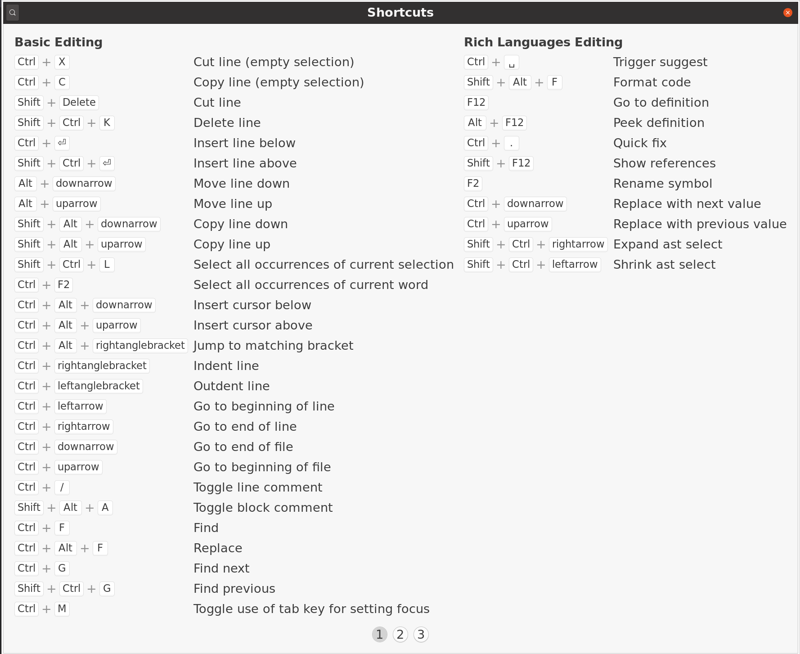
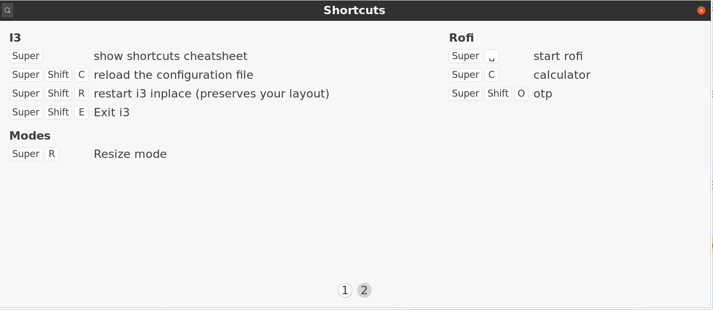

### Cheater

GUI Cheatsheets for Linux written in Rust + GTK



## Installation

cargo install cheater

## Sample I3 Config

```
## I3 // show shortcuts cheatsheet // Super+? ##
bindsym $mod+slash exec cheater
```

## I3 support

By default i3-wm support is included, and if no cheatsheet is found for currently active window, Cheater will show the i3 shortcuts cheat sheet


For Cheater to recognize your bindings in i3 config, please add a comment above each one, in form of:

```
## Category // help text // shortcut ##
```

## Included cheatsheets

I've included some example cheat sheets, converted from https://github.com/Kapeli/cheatsheets#readme

Android_Emulator.json
AppCode_Shortcuts.json
Atom.json
Blender.json
Brackets.json
Chrome_Dev_Tools.json
Grafx2.json
IntelliJ_Shortcuts.json
Jira_Shortcuts.json
Scrivener.json
Sourcetree.json
Sublime_Text_2.json
Sublime_Text_3.json
Textastic.json
Trello.json
Visual_Studio_Code.json
